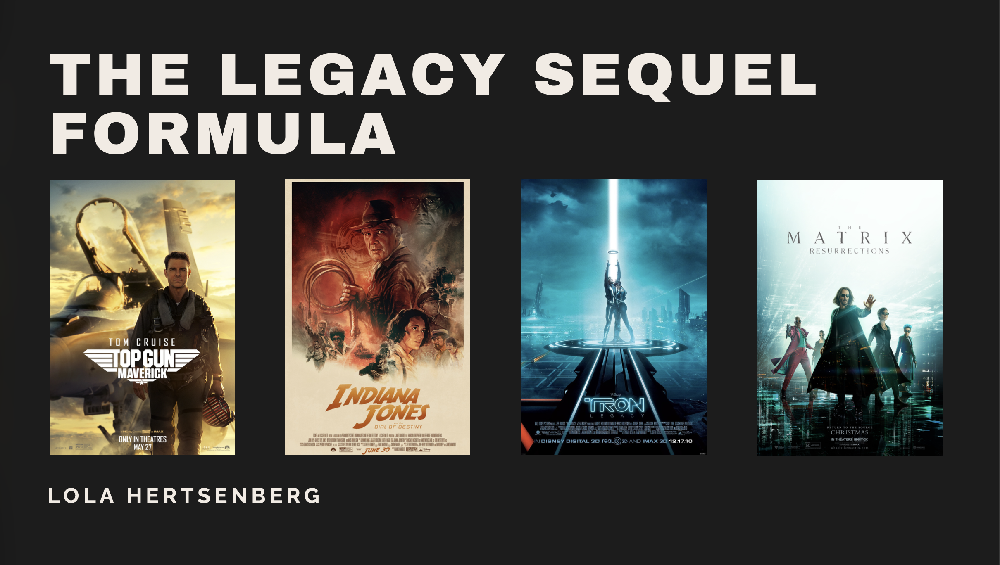
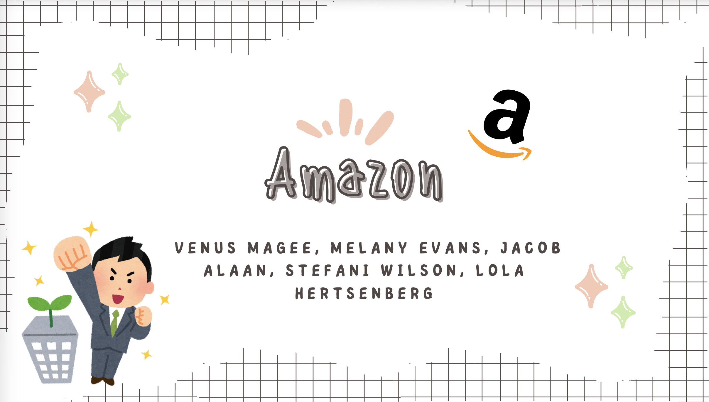
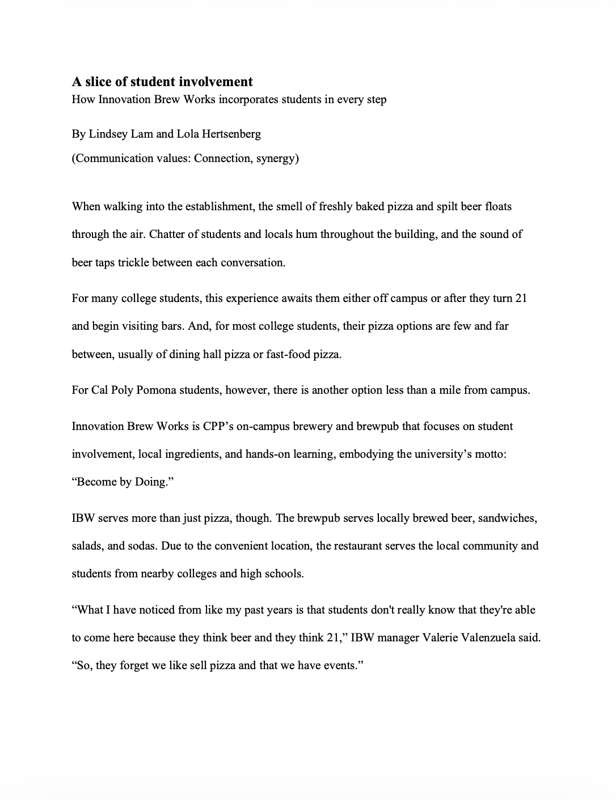
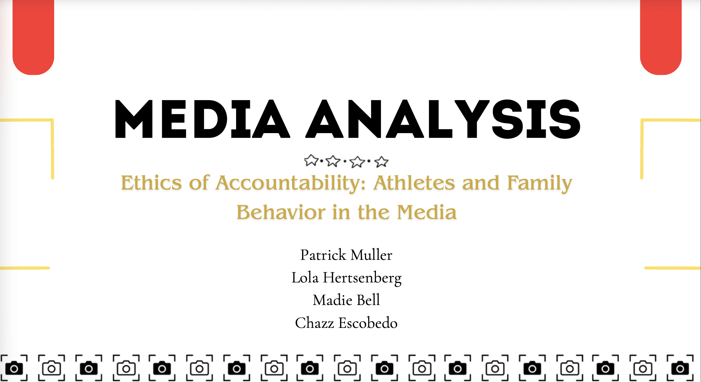

  

    

      MARKETING • MEDIA • STORYTELLING
    

    <h1 class="home-title">
      Marketing, media & storytelling.
    </h1>

    

      I'm a Marketing Management student at Cal Poly Pomona with experience in digital marketing, social media, content creation, and audience strategy. I'm especially interested in entertainment, sports, and long-form media.
    

    <a class="portfolio-button" href="work.qmd">
      VIEW MY WORK →
    </a>

  

  

    
  

  

    

      

        SELECTED WORK
      

      <h2 class="section-title">
        Projects.
      </h2>
    

    <a class="view-all" href="work.qmd">
      VIEW ALL →
    </a>

  

  

    <!-- LEGACY SEQUEL -->

    

      

        

        

          

            ENTERTAINMENT MARKETING
          

          <h3>
            The Legacy Sequel Formula
          </h3>

          

            An analysis of nostalgia, audience expectations, and franchise strategy in legacy sequel marketing.
          

          <a class="project-link" href="legacy-sequel.qmd">
            VIEW PROJECT →
          </a>

        

      

    

    <!-- AMAZON -->

    

      

        

        

          

            MARKETING RESEARCH
          

          <h3>
            Amazon Employee Analysis
          </h3>

          

            A group research project examining employee satisfaction and workplace practices at Amazon.
          

          <a class="project-link" href="amazon-analysis.qmd">
            VIEW PROJECT →
          </a>

        

      

    

    <!-- INNOVATION BREW WORKS -->

    

      

        

        

          

            MULTIMEDIA JOURNALISM
          

          <h3>
            Innovation Brew Works
          </h3>

          

            A multimedia journalism project combining reporting, visual storytelling, and video.
          

          <a class="project-link" href="ibw.qmd">
            VIEW PROJECT →
          </a>

        

      

    

    <!-- ATHLETES -->

    

      

        

        

          

            SPORTS & MEDIA
          

          <h3>
            Athletes, Family & Media
          </h3>

          

            A media analysis examining how athletes and their families are portrayed online.
          

          <a class="project-link" href="athletes-media.qmd">
            VIEW PROJECT →
          </a>

        

      

    

  

  

    

      A LITTLE MORE ABOUT ME
    

    <h2>
      Strategy meets creativity.
    </h2>

    

      From growing social audiences to developing marketing strategies and producing multimedia content, I enjoy finding the story behind an audience and figuring out how to make people care.
    

    <a class="project-link" href="about.qmd">
      MORE ABOUT ME →
    </a>

  

