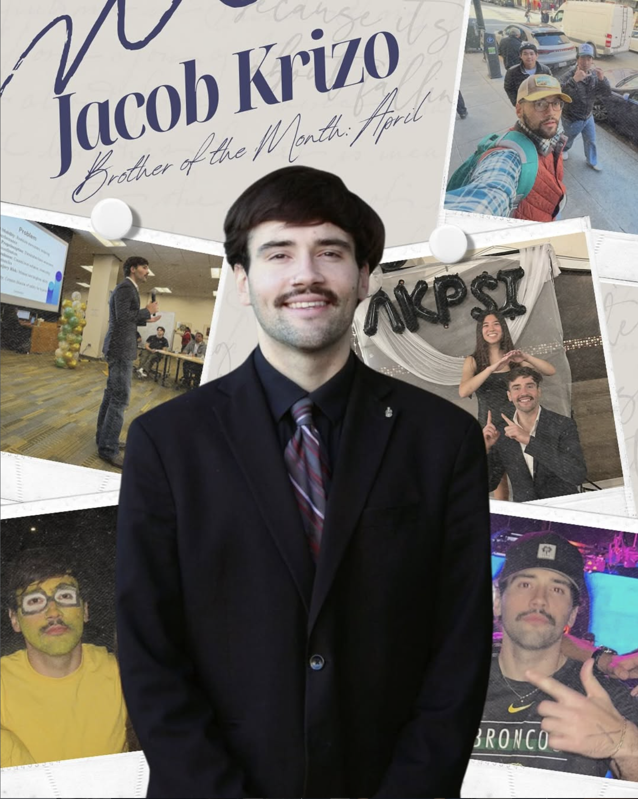
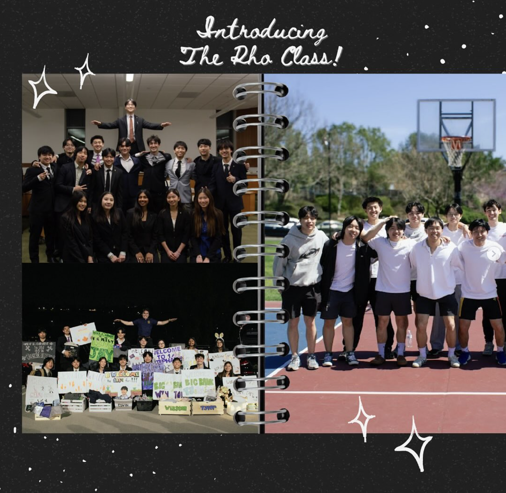

::::: project-hero
::: section-label
SOCIAL MEDIA
:::

<h1 class="project-page-title">

AKPsi Social [Content.]{.pink}

</h1>

Social media content created for Alpha Kappa Psi to promote chapter events, communicate with members, and create engaging content for Instagram.

::: project-skills
CONTENT CREATION • SOCIAL MEDIA • VISUAL DESIGN • VIDEO EDITING
:::
:::::

------------------------------------------------------------------------

:::: case-study-section
::: section-label
ABOUT THE WORK
:::

<h2 class="case-study-title">

Creating content for a student organization.

</h2>

As President of Alpha Kappa Psi, I have contributed to the chapter's social media presence by creating content designed to communicate events and highlight the organization.

These projects gave me experience adapting content for social platforms while considering visual identity, messaging, audience engagement, and short-form video.

::::

------------------------------------------------------------------------

::::::: case-study-section
::: section-label
SOCIAL CONTENT
:::

<h2 class="case-study-title">

Selected posts.

</h2>

::::: social-grid
::: social-item

:::

::: social-item

:::
:::::
:::::::

------------------------------------------------------------------------

:::: case-study-section
::: section-label
SHORT-FORM VIDEO
:::

<h2 class="case-study-title">

Instagram Reel.

</h2>

Short-form video content created for the chapter's social media.

<video class="project-video social-video" controls poster="images/akpsi-3.png">

<source src="projects/akpsi-reel.mp4" type="video/mp4">

Your browser does not support the video element. </video>

------------------------------------------------------------------------
::::
