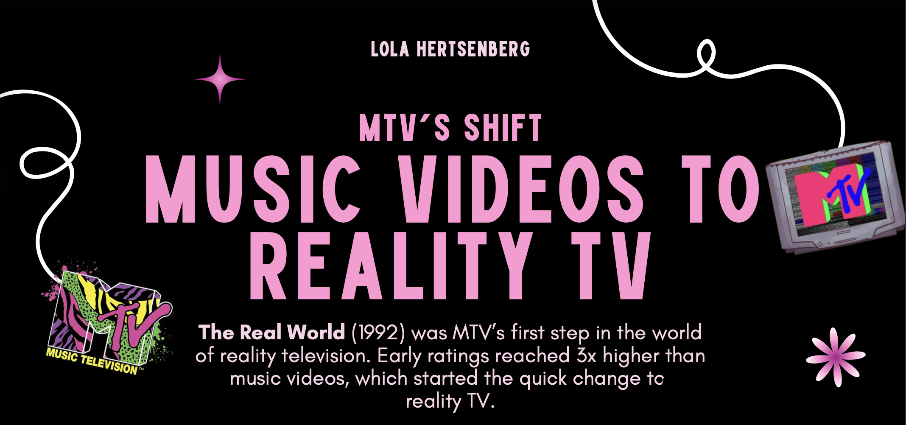

SELECTED WORK

<h1 class="hero-title">
Projects.
</h1>

A selection of marketing, media, research, social media, and
communications projects developed through professional experience,
coursework, and leadership.

<!-- LEGACY SEQUEL -->

ENTERTAINMENT MARKETING

The Legacy Sequel Formula

An entertainment marketing analysis exploring why some legacy sequels
succeed while others struggle, highlighting *Top Gun: Maverick* and
other major franchises to examine nostalgia, audience expectations, and
franchise strategy.

AUDIENCE ANALYSIS • FILM MARKETING • INDUSTRY RESEARCH

<a class="project-link" href="legacy-sequel.qmd">
VIEW PROJECT →
</a>

<!-- SPORTS PR -->

SPORTS MARKETING • PUBLIC RELATIONS

Sports Communication PR

A brand and communications plan developed for a conceptual AAA baseball
franchise, including market research, promotional events, press
releases, and an integrated launch strategy.

SPORTS MARKETING • MARKET RESEARCH • BRAND STRATEGY • PR

<a class="project-link" href="sports-pr.qmd">
VIEW PROJECT →
</a>

<!-- INNOVATION BREW WORKS -->

MULTIMEDIA JOURNALISM

Innovation Brew Works

A partner journalism project combining reporting, visual storytelling,
and an accompanying video to tell the story of Innovation Brew Works.

REPORTING • INTERVIEWING • VIDEO • MULTIMEDIA

<a class="project-link" href="ibw.qmd">
VIEW PROJECT →
</a>

<!-- ATHLETES -->

SPORTS & MEDIA

Athletes, Family & Media

A group media analysis examining how athletes and their families are
portrayed online and how digital media can shape public perception and
reputation around sports figures.

MEDIA ANALYSIS • SPORTS CULTURE • DIGITAL MEDIA • RESEARCH

<a class="project-link" href="athletes-media.qmd">
VIEW PROJECT →
</a>

<!-- AKPSI SOCIAL -->

SOCIAL MEDIA

AKPsi Social Content

Instagram and TikTok content created for Alpha Kappa Psi to promote
chapter events, communicate with members, and build an engaging social
media presence.

SOCIAL MEDIA • CONTENT CREATION • BRAND COMMUNICATION

<a class="project-link" href="social-media.qmd">
VIEW PROJECT →
</a>

<!-- AMAZON -->

MARKETING RESEARCH

Amazon Employee Analysis

A group research project examining employee satisfaction and workplace
practices at Amazon through research, analysis, and strategic
recommendations.

RESEARCH • DATA ANALYSIS • TEAMWORK • PRESENTATION

<a class="project-link" href="amazon-analysis.qmd">
VIEW PROJECT →
</a>

<!-- MTV -->

MEDIA ANALYSIS • INFOGRAPHIC

MTV: Music Videos to Reality TV

A visual media analysis exploring MTV's shift from music videos toward
reality television and its changing role in pop culture.

INFOGRAPHIC DESIGN • MEDIA ANALYSIS • VISUAL STORYTELLING

<a class="project-link" href="mtv-analysis.qmd">
VIEW PROJECT →
</a>

